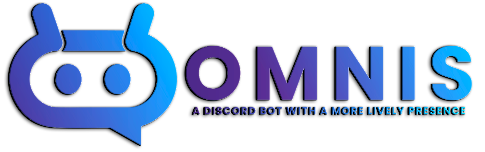

# 

 

<h2 class="feature-header"><b>What is Omnis?</b></h2>

Omnis is a cutting-edge Discord bot that seamlessly integrates Google's Text-to-Speech (TTS) and Speech-to-Text (STT) APIs with OpenAI's advanced prompt generation technology to create a truly unique and personalized user experience.
Designed to bring a new level of interaction and entertainment to your Discord server, Omnis combines the power of these technologies to deliver responses that are both witty and engaging.

With it's distinctive ability to respond with sarcasm, Omnis adds a playful and humorous element to your server's conversations.
Boasting over 700 different voices to choose from, users can customize their interactions with Omnis to suit their preferences, making every interaction feel fresh and exciting.
Whether you're looking for a serious, comedic, or entirely unique voice, Omnis has you covered.

One of the standout features of Omnis is it's capability to take song requests by voice.
Imagine simply speaking your favorite song's name and having Omnis queue it up for you – a feature that sets Omnis apart from other Discord bots.
This voice command functionality makes it easier than ever to interact with your music playlist, adding convenience and a touch of futuristic technology to your server's activities.

In addition to these features, Omnis also provides a range of other functionalities designed to enhance your Discord experience.
Whether you're using Omnis for casual chat, music, or any other server needs, you can expect a high level of performance and reliability.

Experience the future of Discord interactions with Omnis – your server's new favorite bot that combines advanced AI technology with entertaining and practical features.
Add some personality and fun to your Discord community today with Omnis.