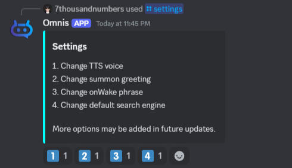

# **Settings**

!!! info "Premium"
	<i> This requires a premium membership. </i>

Using the /settings slash command, you can adjust various configuration options available in Omnis.
These settings allow you to personalize your interaction with the bot, ensuring it aligns with your preferences.
By tailoring these options, you can create a customized experience that best suits your needs.

!!! tip "User settings"
    Any settings you change will be saved for you and will carry across servers.

### **Change Text-to-Speech voice**

!!! tip "Voice channel"
    Omnis needs to be in a voice channel in order to change the voice.
	
!!! tip "Voice types"
    Omnis supports all of Google's Text-to-Speech voice types:
	
	- Neural2 - Based on the same technology used to create a Custom Voice.
	- Standard - The synthetic speech technology used to create the machine model of the voice.
	- WaveNet - The technology used to produce speech for Google Assistant, Google Search, and Google Translate.
	- Polyglot - These voices can speak multiple languages.
	- Studio - Narration voices designed for news and broadcast content.
	- News - Another small branch of Studio voices.
	- Journey - Spontaneous conversational voices based on AudioLM.
	- Casual - Designed for conversational, imperfect dialogue for comfort.
	
!!! tip ""
    In addition to supporting all voice types, Omnis supports all of Google's available Text-to-Speech voices. That's over 700 voices to choose from!
	
1. Use the /settings command:
 

2. Select "Change TTS Voice"
3. Select a voice type:
 

4. Select a language:
 

5. Select a voice:
 

### **Change summon greeting**

!!! question "What is this?"
    Your summon greeting is what Omnis will say when you summon it to your voice channel using the /summon command.

1. Use the /settings command:
 

2. Select "Change summon greeting"
3. Omnis will send you a direct message informing you that the next message you send in a direct message channel with Omnis will be used as your new summon greeting.

### **Change onWake phrase**

!!! question "What is this?"
    Your onWake phrase is what Omnis will say when you wake it up in your voice channel by saying it's name or using the /wakeup command.

1. Use the /settings command:
 

2. Select "Change onWake phrase"
3. Omnis will send you a direct message informing you that the next message you send in a direct message channel with Omnis will be used as your new onWake phrase.

### **Change default search engine**

!!! question "What is this?"
    This will determine what search engine to use by default for when you search for a track.

1. Use the /settings command:
 

2. Select "Change default search engine"
3. Select a search engine.
 
